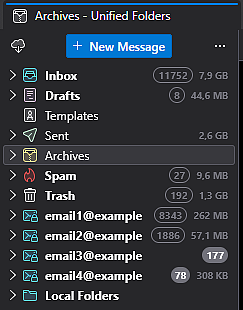
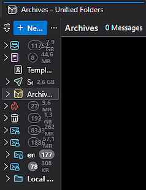
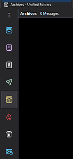

# Compact Unified Folder Pane

A small Thunderbird extension that adds a compact icon-only state to the
**Unified Folders** pane.

It fills the gap between Thunderbird's full Folder Pane and a completely
collapsed pane. As the pane is narrowed, secondary information is removed,
folder labels give way to centered icons, and Thunderbird's native full
collapse remains available by dragging farther.

## Preview

The extension keeps Thunderbird's normal expanded **Unified Folders** pane, but
replaces the awkward narrow intermediate state with a compact icon rail.

<table>
  <tr>
    <th>Default Thunderbird</th>
    <th>Without the extension</th>
    <th>With the extension</th>
  </tr>
  <tr>
    <td align="center"></td>
    <td align="center"></td>
    <td align="center"></td>
  </tr>
  <tr>
    <td>Normal expanded Unified Folders pane.</td>
    <td>Narrowing the pane leaves labels and metadata cramped.</td>
    <td>Compact icon rail with full collapse still available.</td>
  </tr>
</table>

## Why

The Folder Pane can take a significant amount of horizontal space in a
three-pane mail layout. Thunderbird can collapse it completely, but it does
not provide an intermediate state that keeps the main folders directly
accessible.

Unified Folders are a good fit for an icon rail because folders such as
Inbox, Drafts, Sent, Archives, Junk and Trash have distinct and recognizable
roles. Arbitrary folder trees can contain many folders with similar icons, so
the compact rail activates only when **Unified Folders is the sole active
folder mode**.

## Features

- Adds a compact icon-only state between the full and collapsed Folder Pane.
- Progressively removes secondary folder information as the pane narrows.
- Centers Unified Folder icons in the compact rail.
- Preserves Thunderbird's native full-collapse behavior.
- Keeps the original Folder Pane actions available from compact mode.
- Reuses Thunderbird's own Get Messages, New Message and folder-menu controls.
- Activates only when Unified Folders is the only active folder mode.
- Makes no network requests and does not read or transmit message content.

## Behavior

The pane changes progressively as it is resized:

- Below `160 px`, folder counts, sizes and mode headings are hidden and
  **New Message** becomes the native square `+` button.
- Below `120 px`, folder labels and disclosure arrows are hidden and the pane
  becomes an icon rail.
- Below `100 px`, the Folder Pane header changes to a compact trigger. Hovering
  or keyboard-focusing it reveals Thunderbird's original actions as a floating
  toolbar.
- At `60 px`, the pane reaches its compact snap width.
- Dragging farther performs Thunderbird's normal full collapse.

## Compatibility

The extension is currently tested with:

```text
Thunderbird 128 ESR / Windows 11
Thunderbird 153     / Windows 10
Thunderbird 156     / Windows 11
```

The manifest requires Thunderbird `128.0` or newer. Because the extension uses a
small Experiment API against Thunderbird's internal Folder Pane UI, newer
Thunderbird versions should still be tested when they are released.

## Technical note

Thunderbird's public MailExtension API exposes Folder Pane visibility, but not
the splitter width or collapse threshold needed for the compact intermediate
state.

The extension therefore uses a deliberately small Experiment API for the
Folder Pane UI. This can cause Thunderbird to display a broad full-access
permission warning even though the extension itself is limited to this UI
behavior.

## Installation

Download the latest XPI from the
[GitHub Releases](https://github.com/jankuzelka/compact-unified-folder-pane/releases) page.

In Thunderbird:

1. Open **Add-ons and Themes**.
2. Open the gear menu and choose **Install Add-on From File**.
3. Select the downloaded XPI.

## Development

To load the extension temporarily during development:

1. Open **Add-ons and Themes** in Thunderbird.
2. Open the gear menu and choose **Debug Add-ons**.
3. Choose **Load Temporary Add-on**.
4. Select `manifest.json` from the project directory.

To build an XPI on Windows:

```powershell
./scripts/build-xpi.ps1
```

The generated XPI is a ZIP archive with `manifest.json` at its root.

## Support

If you find this extension useful, you can support its continued development.

[](https://buymeacoffee.com/jankuzelka)

## Author

Jan Kuželka — [https://kuzelka.dev](https://kuzelka.dev)

## License

MPL-2.0. See [LICENSE](LICENSE).
